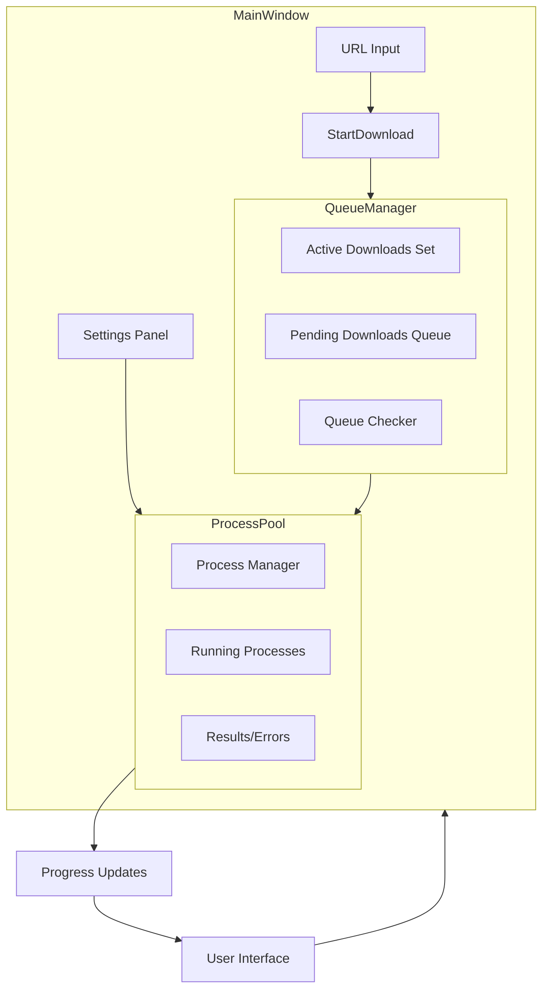
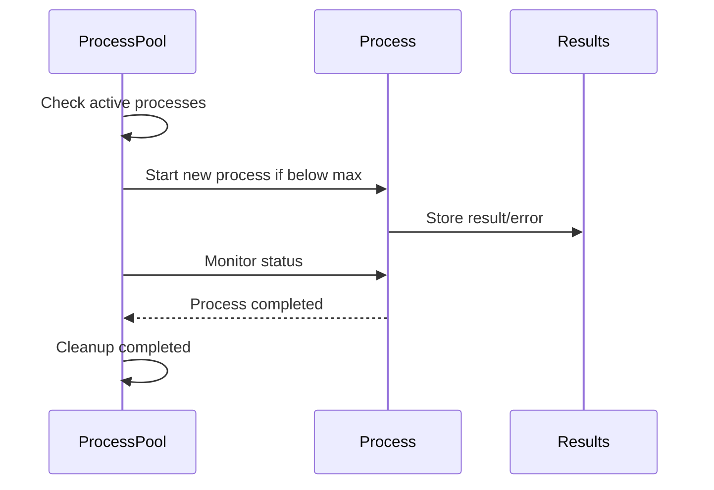
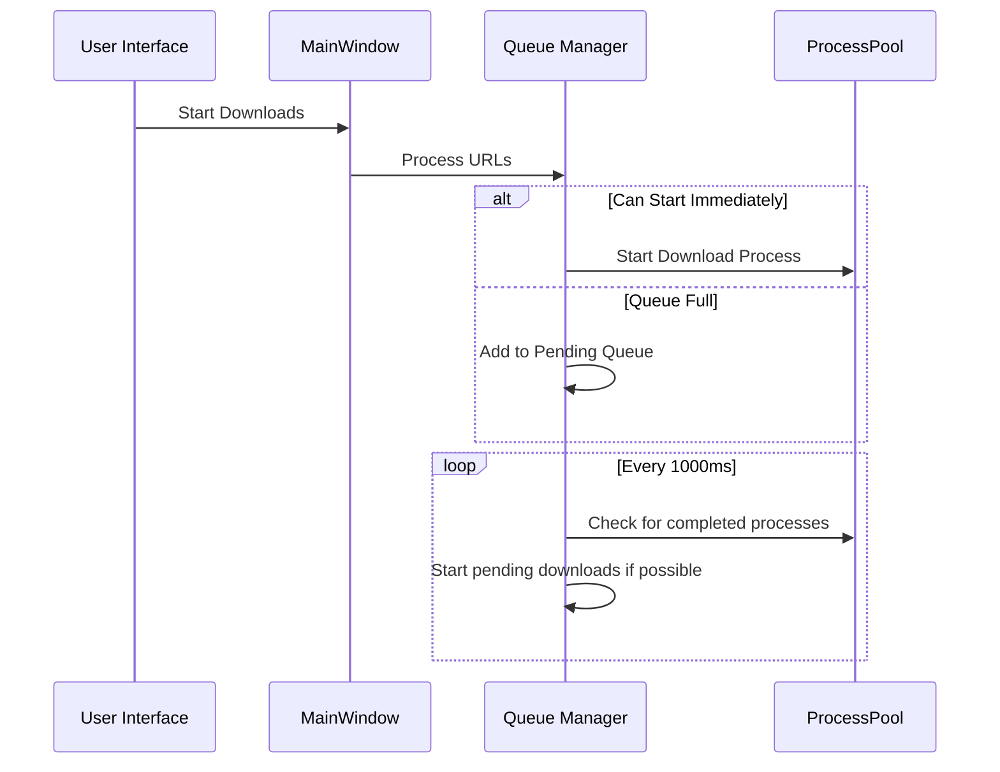

# JustDownloadIt - Download Management Architecture

## High-Level System Overview

```mermaid
graph TB
    UI[User Interface] --> MainWindow
    subgraph MainWindow
        URL[URL Input] --> StartDownload
        Settings[Settings Panel] --> ProcessPool
        StartDownload --> QueueManager
    end
    
    subgraph QueueManager
        ActiveDownloads[Active Downloads Set]
        PendingQueue[Pending Downloads Queue]
        QueueChecker[Queue Checker]
    end
    
    subgraph ProcessPool
        ProcessManager[Process Manager]
        Processes[Running Processes]
        Results[Results/Errors]
    end
    
    QueueManager --> ProcessPool
    ProcessPool --> ProgressUpdates[Progress Updates]
    ProgressUpdates --> UI
```

## Process Pool Management Flow

```mermaid
sequenceDiagram
    participant PP as ProcessPool
    participant P as Process
    participant R as Results
    
    PP->>PP: Check active processes
    PP->>P: Start new process if below max
    P->>R: Store result/error
    PP->>P: Monitor status
    P-->>PP: Process completed
    PP->>PP: Cleanup completed
```

## Download Queue Flow

```mermaid
sequenceDiagram
    participant UI as User Interface
    participant MW as MainWindow
    participant Q as Queue Manager
    participant PP as ProcessPool
    
    UI->>MW: Start Downloads
    MW->>Q: Process URLs
    alt Can Start Immediately
        Q->>PP: Start Download Process
    else Queue Full
        Q->>Q: Add to Pending Queue
    end
    
    loop Every 1000ms
        Q->>PP: Check for completed processes
        Q->>Q: Start pending downloads if possible
    end
```